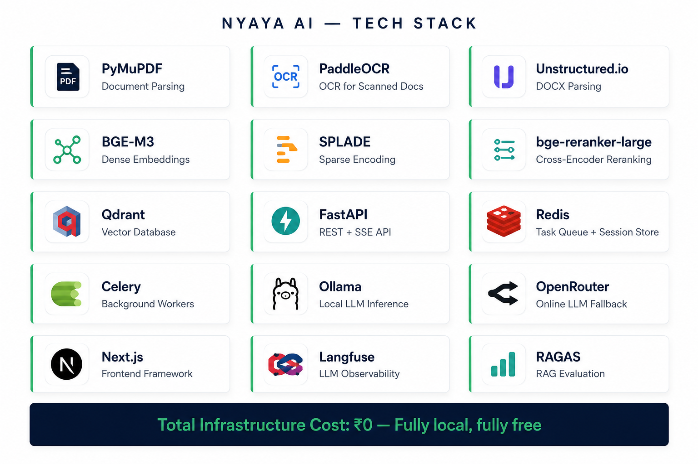

# Nyaya AI — Indian Legal Intelligence Platform

> *Know what you sign.*

Nyaya (न्याय) — Sanskrit for justice, and the Indian school of logical
reasoning and correct argument.

---

## Demo
*Live URL and Loom walkthrough will appear here after Week 4 deployment.*

---

## What is Nyaya AI?

A first-time founder or MSME owner receives a contract from a bigger company.
They cannot afford ₹15,000/hour legal review. They upload the PDF.
Nyaya AI tells them exactly what they agreed to, what is legally risky
or unenforceable under Indian law, and what to push back on —
with the exact clause cited, page and paragraph.

---

## Core Architecture Overview

Nyaya AI is designed to run **entirely locally and free of operational cost** (₹0 per query for 95% of workloads).

* **Document Parsing & Ingestion:** Native text extraction via [PyMuPDF](https://github.com/pymupdf/PyMuPDF) and [Unstructured](https://github.com/Unstructured-IO/unstructured), with [PaddleOCR](https://github.com/PaddlePaddle/PaddleOCR) as the fallback OCR engine for scanned contracts.
* **Chunking Strategy:** Structural chunking based on document sections and clauses, falling back to LLM-guided structure detection for poorly-formatted PDFs.
* **Hybrid Retrieval:** Dense-sparse hybrid search utilizing [BGE-M3](https://huggingface.co/BAAI/bge-m3) embeddings and SPLADE sparse representation stored in [Qdrant](https://qdrant.tech/), reranked via `bge-reranker-large` for maximum citation precision.
* **LLM Cost Cascade:** A cost-effective cascading execution flow:
  1. **Tier 1 (Local):** [Phi-3 Mini](https://huggingface.co/microsoft/Phi-3-mini-4k-instruct) via Ollama (handles 80-90% of routine clauses).
  2. **Tier 2 (Local):** [Gemma-2-9B](https://huggingface.co/google/gemma-2-9b-it) via Ollama (handles complex legal logic).
  3. **Tier 3 (Cloud Fallback):** OpenRouter free tier models (last resort for high-complexity queries).
* **Extraction Framework:** Validated JSON schema extraction via [Pydantic v2](https://docs.pydantic.dev/) with programmatic retry and cascade propagation on validation failure.
* **Backend:** Async task processing engine powered by [FastAPI](https://fastapi.tiangolo.com/), [Celery](https://docs.celeryq.dev/), and [Redis](https://redis.io/).
* **Frontend:** High-performance dashboard built with [Next.js](https://nextjs.org/) and styled using [shadcn/ui](https://ui.shadcn.com/) (authority dark theme).
* **Observability:** Complete visibility via [Langfuse](https://langfuse.com/) (LLM span tracing) and `structlog` (structured JSON logging for Celery and pipelines).

---

## Documents

| Document | Link | Status |
|---|---|---|
| Problem Statement | [problem-statement.md](problem-statement.md) | Complete |
| Initial Design Doc | [initial-design-doc.md](initial-design-doc.md) | Complete |
| Architecture | [architecture.md](architecture.md) | Complete |
| Data Sources | [docs/data.md](docs/data.md) | In progress |
| ADRs | [docs/adr/](docs/adr/) | Complete (ADR-001 to ADR-009) |
| AI Session Logs | [docs/ai-conversations/](docs/ai-conversations/) | Active |

---

## Quickstart
*Will be completed after Week 1 foundation sprint.*

---

## Evaluation Results

| Metric | Target | Achieved |
|---|---|---|
| Citation Precision | > 90% | TBD |
| Hallucination Rate | < 5% | TBD |
| Extraction F1 | > 0.88 | TBD |
| Cost per contract | < ₹0.50 | TBD |

---

## AI-Assisted Development Log

Every session with the AI coding agent is logged with decisions made,
options considered, and reasoning. See [/docs/ai-conversations/](./docs/ai-conversations/).

---

## License
MIT
