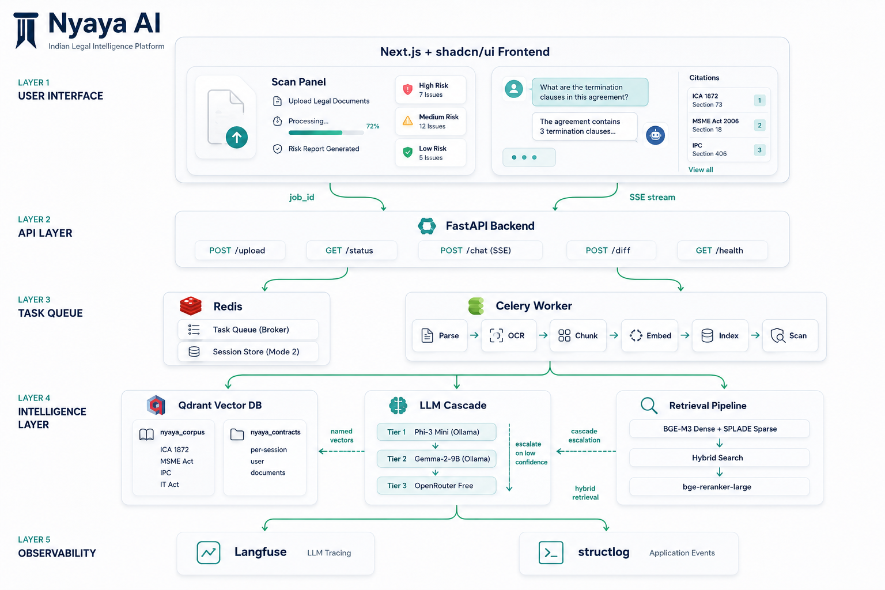

# Architecture — Nyaya AI: Contract Intelligence

**Project:** Nyaya AI — Indian Legal Intelligence Platform
**Module:** Contract Intelligence (Internship Scope)
**Author:** Mehtab Singh
**Date:** 26 June 2026
**Status:** Accepted — all decisions logged in ADR-001 through ADR-009
**Mentor Review Due:** 26 June 2026

---

## 1. System Overview

Nyaya AI is a two-mode legal intelligence platform. Both modes retrieve from the same underlying infrastructure — a shared Indian legal corpus and a per-session contract index. The retrieval, cascade, and citation logic are shared components; what differs between modes is the trigger (automatic scan vs. conversational query) and the output shape (structured risk report vs. cited chat response).

```
                        ┌──────────────────────────────────┐
                        │         Nyaya AI Platform         │
                        │                                   │
              ┌─────────┤  Mode 1: Automatic Scan           │
              │         │  Mode 2: Legal Intelligence Chat  │
              │         └──────────────────────────────────┘
              │
   ┌──────────▼──────────────────────────────────────────────────┐
   │                   Shared Infrastructure                      │
   │                                                              │
   │   ┌─────────────────┐     ┌──────────────────────────────┐  │
   │   │  nyaya_corpus   │     │     nyaya_contracts           │  │
   │   │  (Qdrant)       │     │     (Qdrant)                  │  │
   │   │  ICA 1872       │     │  User-uploaded contracts      │  │
   │   │  MSME Act 2006  │     │  Scoped per session UUID      │  │
   │   │  IT Act 2000    │     │                               │  │
   │   │  IPC 1860, CPC  │     │  Named vectors: dense+sparse  │  │
   │   │  Named vectors  │     └──────────────────────────────┘  │
   │   └─────────────────┘                                        │
   │                                                              │
   │   BGE-M3 (dense) + SPLADE (sparse) + bge-reranker-large      │
   │   Hybrid retrieval: single Qdrant named-vector query          │
   │                                                              │
   │   LLM Cascade: Phi-3 Mini → Gemma-2-9B → OpenRouter          │
   │   (all free — Tiers 1 & 2 via Ollama local)                  │
   └──────────────────────────────────────────────────────────────┘
```

---

## 2. Full System Architecture



```
┌─────────────────────────────────────────────────────────────────────┐
│                         Next.js Frontend                            │
│  ┌──────────────────────┐  ┌──────────────────────────────────────┐ │
│  │     Scan Panel        │  │         Chat Panel                   │ │
│  │  Drag-drop upload     │  │  SSE streaming responses             │ │
│  │  Progress (polling)   │  │  Citation sidebar                    │ │
│  │  Risk report          │  │  "I don't know" state                │ │
│  │  Severity: R/A/G      │  │  Conversation history                │ │
│  │  Confidence per find. │  │                                      │ │
│  └──────────┬────────────┘  └────────────────┬─────────────────────┘ │
└─────────────┼──────────────────────────────────┼─────────────────────┘
              │ POST /upload                      │ POST /chat (SSE)
              │ GET  /status/{job_id}             │ DELETE /session/{id}
              ▼                                  ▼
┌─────────────────────────────────────────────────────────────────────┐
│                        FastAPI Backend                              │
│                                                                     │
│   POST /upload → validate → assign job_id → enqueue Celery task     │
│   GET  /status/{job_id} → check Redis → return status/results       │
│   POST /chat → retrieve → cascade → stream SSE → update session     │
│   POST /diff → ingest 2 contracts → semantic diff → return report   │
│   GET  /health                                                       │
└──────────────────┬──────────────────────────────────────────────────┘
                   │
        ┌──────────┴──────────┐
        │                     │
        ▼                     ▼
┌───────────────┐    ┌─────────────────────────────────────────────┐
│  Redis        │    │           Celery Worker                     │
│               │    │                                             │
│  • Task queue │    │  ingest_contract(job_id, file_path)         │
│    (broker)   │    │  ┌─────────────────────────────────────┐   │
│               │    │  │ 1. Parse PDF/DOCX                   │   │
│  • Session    │    │  │    PyMuPDF + Unstructured.io         │   │
│    store for  │    │  │ 2. OCR if scanned (PaddleOCR)        │   │
│    Mode 2     │    │  │ 3. Structural chunking               │   │
│    chat       │    │  │    → LLM fallback if no structure    │   │
│    history    │    │  │ 4. Embed chunks (BGE-M3/FastEmbed)   │   │
│               │    │  │ 5. Index → nyaya_contracts (Qdrant)  │   │
│  • Results    │    │  │ 6. Run risk scan engines             │   │
│    store      │    │  │    ICA §27 · MSME · Diff · Batch     │   │
│    results:   │    │  │ 7. Validate outputs (Pydantic v2)    │   │
│    {job_id}   │    │  │ 8. Store results → Redis             │   │
└───────────────┘    │  └─────────────────────────────────────┘   │
                     └─────────────────────────────────────────────┘
                                        │
                           ┌────────────┴───────────────┐
                           │                            │
                           ▼                            ▼
              ┌─────────────────────┐    ┌──────────────────────────┐
              │   Qdrant            │    │   Ollama (local)          │
              │                     │    │                           │
              │  nyaya_corpus       │    │  Tier 1: Phi-3 Mini       │
              │  nyaya_contracts    │    │  Tier 2: Gemma-2-9B       │
              │                     │    │                           │
              │  Named vectors:     │    │  + OpenRouter (Tier 3,    │
              │  dense (BGE-M3)     │    │    online free fallback)  │
              │  sparse (SPLADE)    │    └──────────────────────────┘
              │                     │
              │  Hybrid retrieval   │
              │  + bge-reranker-    │
              │    large reranking  │
              └─────────────────────┘
                           │
              ┌────────────┴────────────┐
              │                         │
              ▼                         ▼
  ┌────────────────────┐   ┌─────────────────────────────┐
  │   Langfuse         │   │   structlog (JSON)           │
  │   (self-hosted)    │   │                             │
  │                    │   │  cascade_escalation         │
  │  LLM call traces   │   │  cite_or_refuse_triggered   │
  │  Cascade spans     │   │  pydantic_validation_failure│
  │  RAGAS scores      │   │  ocr_fallback_triggered     │
  │  Token counts      │   │  cross_collection_merge     │
  └────────────────────┘   └─────────────────────────────┘
```

---

## 3. Document Ingestion Pipeline (Mode 1)

**ADR-001:** Structural chunking primary; LLM-based structural chunking as fallback.

```
Input: PDF / DOCX / scanned image
       │
       ▼
  Format detection
       │
  ┌────┴──────────────────────────────────────────────────┐
  │ DOCX                 │ Native PDF      │ Scanned PDF   │
  ▼                      ▼                 ▼               │
Unstructured.io      PyMuPDF           PaddleOCR           │
                                       (OCR layer)         │
  └────────────────────────┬────────────────┘              │
                           ▼
                  Structural chunking
                  (detect clause headings,
                   numbered sections,
                   schedule boundaries)
                           │
                   ┌───────┴──────────────┐
                   │ Structure detected?  │
                   └───────┬──────────────┘
                    Yes    │    No
                    │      │    └──→ LLM-based structural
                    │      │         chunking (fallback)
                    ▼      ▼         [model TBD — Week 2]
              Clause-level chunks with metadata:
              { clause_number, clause_heading,
                page, paragraph, text }
                           │
                           ▼
               Embed: BGE-M3 (dense) via FastEmbed
               Encode: SPLADE (sparse)
                           │
                           ▼
               Index → nyaya_contracts (Qdrant)
               Named vectors: dense + sparse
```

**Chunk metadata preserved per chunk:**
```python
{
    "session_id": "uuid",
    "contract_type": "employment",
    "clause_number": "12.3",
    "clause_heading": "Restrictive Covenants",
    "page": 4,
    "paragraph": 2,
    "text": "Employee shall not...",
    "ingested_at": "2026-07-01T10:30:00Z"
}
```

---

## 4. Indian Legal Corpus

**ADR-003:** `nyaya_corpus` — persistent, versioned, shared across all users.

### Corpus Build Plan

| Week | Corpus content |
|------|---------------|
| Week 1 (MVP) | Indian Contract Act 1872, MSME Development Act 2006, IT Act 2000, IPC 1860, Code of Civil Procedure |
| Week 3 (extended, if time) | Consumer Protection Act, Arbitration and Conciliation Act, Industrial Disputes Act, SEBI regulations |

**Ingestion pipeline for statutory text:**
```
Source: India Code (indiacode.nic.in) — public domain
       │
       ▼
Download Act as PDF → PyMuPDF parse
       │
       ▼
Section-level chunking (structural — Acts have consistent §N structure)
       │
       ▼
Metadata per chunk:
{ act_name, section_number, section_title,
  chapter, page, text, version, source_url }
       │
       ▼
Embed (BGE-M3) + encode (SPLADE) → index into nyaya_corpus
```

**Versioning:** corpus version tag on every chunk. When an Act is updated, old chunks are soft-deleted (Qdrant payload filter) and new chunks indexed with the new version. No reindex required for chunks belonging to other Acts.

> **Current limitation:** Mode 1 initially relies on the existing `mratanusarkar/Indian-Laws` snapshot. Its amendment currency has not been verified against India Code for every Act, so findings must not be represented as a guarantee of amendment-current law.

---

## 5. Retrieval Pipeline

**ADR-002 (BGE-M3 + bge-reranker-large), ADR-003 (named vectors, hybrid search)**

```
Query (question or scan trigger)
       │
       ▼
Determine collection scope:
  Mode 2 general question → nyaya_corpus only
  Mode 2 document question → nyaya_corpus + nyaya_contracts (merge)
  Mode 1 scan → nyaya_contracts (risk engines query corpus separately)
       │
       ▼
Hybrid retrieval (single Qdrant named-vector query per collection):
  dense: BGE-M3 cosine similarity
  sparse: SPLADE dot product
  Qdrant fusion → top-k candidates
       │
       ▼
Cross-encoder reranking: bge-reranker-large
  Reads full (query, chunk) pair with attention
  Re-scores top-k → re-sorted final candidates
       │
       ▼
Top-5 chunks passed to LLM cascade
```

**Cross-collection merge (Mode 2, document + corpus query):**
Two named-vector queries run in parallel → results merged at application layer by score → reranker applied to combined set → top-5 passed to LLM. Event logged: `cross_collection_merge`.

---

## 6. LLM Cascade

**ADR-004:** Confidence-threshold cascade, fully free.

```
Query + retrieved context (top-5 chunks)
       │
       ▼
┌──────────────────────────────────────┐
│  Tier 1: Phi-3 Mini via Ollama       │
│  Fast, local, CPU-capable            │
│  Returns: structured output + conf.  │
└──────────────────┬───────────────────┘
                   │
          confidence ≥ 0.70?
          Pydantic valid?
                   │
             Yes   │   No (either)
              │    │
              │    ▼
              │  ┌──────────────────────────────────────┐
              │  │  Tier 2: Gemma-2-9B via Ollama       │
              │  │  Better reasoning, local, GPU ideal  │
              │  │  Returns: structured output + conf.  │
              │  └──────────────────┬───────────────────┘
              │                     │
              │            confidence ≥ 0.70?
              │            Pydantic valid?
              │                     │
              │               Yes   │   No (either)
              │                │    │
              │                │    ▼
              │                │  ┌──────────────────────────────────────┐
              │                │  │  Tier 3: OpenRouter free tier        │
              │                │  │  Online fallback, last resort        │
              │                │  │  Returns: structured output + conf.  │
              │                │  └──────────────────┬───────────────────┘
              │                │                     │
              │                │            confidence ≥ 0.70?
              │                │            Pydantic valid?
              │                │                     │
              │                │               Yes   │   No
              │                │                │    ▼
              │                │                │  Cite-or-refuse:
              │                │                │  { can_answer: false,
              │                │                │    reason: "...",
              │                │                │    confidence: 0.XX }
              └────────────────┘────────────────┘
                       Return to caller
```

**Escalation triggers:** confidence < 0.70 OR Pydantic schema validation failure.
**On Pydantic failure:** one retry at same tier → second failure escalates.
**Logged:** every escalation as `cascade_escalation`, every cite-or-refuse as `cite_or_refuse_triggered`.

---

## 7. Risk Scan Engines (Mode 1)

Four engines run automatically on every contract upload after ingestion:

### Engine 1 — ICA §27 Enforcement Engine
```
Query nyaya_corpus: "non-compete restraint of trade void ICA §27"
Query nyaya_contracts: "non-compete employee shall not compete"
Retrieve → rerank → cascade
Output: RiskFinding {
  clause_number, clause_text, page,
  risk_type: "non_compete",
  risk_level: "high",
  legal_basis: "Indian Contract Act §27",
  finding: "Likely void — ICA §27 renders agreements restraining trade void",
  negotiation_stance: "Request removal or replace with narrowly scoped non-solicitation",
  confidence: 0.94
}
```

### Engine 2 — MSME Payment Term Detector
```
Query nyaya_contracts: "payment term days invoice supplier vendor"
Extract: payment_term_days from ClauseExtraction
If payment_term_days > 45:
Output: MSMEViolation {
  clause_number, clause_text, page,
  payment_term_days: 90,
  violation: "Payment term exceeds 45-day statutory maximum",
  statutory_remedy: "Buyer liable for compound interest at 3× RBI bank rate",
  legal_basis: "MSME Development Act 2006, §15–23",
  confidence: 0.91
}
```

### Engine 3 — Semantic Clause Diff Engine
```
Input: two contract versions (v1, v2)
Both ingested → nyaya_contracts (separate session IDs)
For each clause in v1: find nearest neighbour in v2 by dense similarity
Diff types: changed, deleted, added, riskier
Output: ClauseDiff[] { clause_number, change_type, v1_text, v2_text,
                        risk_delta: "increased"|"decreased"|"unchanged",
                        explanation }
```

### Engine 4 — Agentic Batch Sweep
```
Input: folder of contracts + natural-language query
       e.g. "find contracts that auto-renew without a notice clause"
For each contract: ingest → retrieve → cascade → score relevance
Output: ranked list of contracts with evidence snippets
```

---

## 8. Mode 2 — Legal Intelligence Chat

**ADR-003 (cross-collection), ADR-006 (Redis session store)**

```
POST /chat { session_id, message, document_id? }
       │
       ▼
Load conversation history from Redis: session:{session_id}
       │
       ▼
Determine query scope:
  Has document_id? → query nyaya_corpus + nyaya_contracts
  No document_id?  → query nyaya_corpus only
       │
       ▼
Retrieval → rerank → cascade → CitedAnswer
       │
       ▼
Append turn to Redis: session:{session_id} (with TTL: 24h)
       │
       ▼
Stream CitedAnswer via SSE:
  {
    "answer": "Under ICA §27, agreements restraining trade are void...",
    "citations": [
      { "source_type": "statute", "act_name": "Indian Contract Act 1872",
        "section": "§27", "quote": "Every agreement by which anyone is restrained..." }
    ],
    "confidence": 0.91,
    "can_answer": true
  }
```

**Cite-or-refuse in Mode 2:**
If `can_answer: false`, the frontend renders a distinct UI state — not an empty response. The response includes what the system could and could not find. This is a first-class product state, not an error condition.

---

## 9. Structured Extraction Schemas

**ADR-005:** Pydantic v2 + JSON mode. All output types below.

```python
class RiskFinding(BaseModel):
    clause_number: str
    clause_heading: Optional[str]
    clause_text: str
    page: int
    paragraph: Optional[int]
    risk_type: Literal["non_compete","payment_term_violation",
                       "uncapped_liability","broad_ip_assignment",
                       "auto_renewal","broad_indemnity","other"]
    risk_level: Literal["high","medium","low"]
    legal_basis: str
    finding: str
    negotiation_stance: str
    confidence: float

class ClauseExtraction(BaseModel):
    parties: List[str]
    governing_law: Optional[str]
    effective_date: Optional[str]
    term_months: Optional[int]
    termination_notice_days: Optional[int]
    liability_cap: Optional[str]
    payment_term_days: Optional[int]
    has_non_compete: bool
    has_ip_assignment: bool
    has_arbitration_clause: bool

class CitedAnswer(BaseModel):
    answer: str
    citations: List[Citation]
    confidence: float
    can_answer: bool

class Citation(BaseModel):
    source_type: Literal["statute","contract"]
    act_name: Optional[str]
    section: Optional[str]
    clause_number: Optional[str]
    page: Optional[int]
    quote: str
```

---

## 10. Evaluation Framework

**ADR-008:** RAGAS + custom citation metric, 100-question test set, difficulty-tagged.

| Metric | Measurement method | Target |
|--------|-------------------|--------|
| Citation precision | Custom metric: clause_number + page exact match vs. ground truth | > 90% |
| Hallucination rate | RAGAS faithfulness < 0.80 → counted as hallucination | < 5% |
| Extraction F1 | Field-level F1 across ClauseExtraction schema | > 0.88 |
| Cost per contract | Langfuse token logging (₹0 — all local) | ₹0 |

**Test set:** 100 Q&A pairs, hand-labelled in Week 3. Three difficulty tiers: simple extraction (~40), risk classification (~35), complex legal reasoning (~25). Results broken down by difficulty tier — not reported as a single overall number.

**Dashboard:** All four metrics rendered live in the frontend eval panel. Updated on each eval run. Not a README table.

---

## 11. Observability

**ADR-009:** Langfuse (LLM layer) + structlog (application layer).

### Mandatory logged events (all five — no exceptions):

| Event | When |
|---|---|
| `cascade_escalation` | Every time a query moves from Tier N to Tier N+1 |
| `cite_or_refuse_triggered` | Every time `can_answer: false` is returned |
| `pydantic_validation_failure` | Every time schema validation fails on LLM output |
| `ocr_fallback_triggered` | Every time PaddleOCR runs (no structural markers) |
| `cross_collection_merge` | Every Mode 2 query that retrieves from both collections |

Langfuse self-hosted in Docker. RAGAS scores attached to traces. Every Mode 2 session is one Langfuse trace with child spans per retrieval and LLM call.

---

## 12. Tech Stack — Confirmed Decisions

| Component | Choice | ADR |
|-----------|--------|-----|
| Document parsing | PyMuPDF + PaddleOCR + Unstructured.io | — |
| Chunking | Structural → LLM fallback | ADR-001 |
| Embeddings | BGE-M3 via HuggingFace + Qdrant FastEmbed | ADR-002 |
| Reranking | bge-reranker-large (cross-encoder) | ADR-002 |
| Vector DB | Qdrant — 2 collections, named vectors | ADR-003 |
| Sparse encoding | SPLADE | ADR-003 |
| LLM Tier 1 | Phi-3 Mini via Ollama (local) | ADR-004 |
| LLM Tier 2 | Gemma-2-9B via Ollama (local) | ADR-004 |
| LLM Tier 3 | OpenRouter free tier (online fallback) | ADR-004 |
| Extraction | Pydantic v2 + JSON mode | ADR-005 |
| Backend | FastAPI + Celery + Redis | ADR-006 |
| Frontend | Next.js + shadcn/ui (dark navy) | ADR-007 |
| Evaluation | RAGAS + custom citation metric | ADR-008 |
| LLM tracing | Langfuse (self-hosted Docker) | ADR-009 |
| App logging | structlog (structured JSON) | ADR-009 |
| Deployment | TBD — Week 4/5 | ADR-010 |

**Total infrastructure cost: ₹0.** All LLM inference is local (Ollama). All services run in Docker. No paid API at steady state.

---

## 13. Build Order and Weekly Milestones

| Week | What ships |
|------|-----------|
| **Week 1** | Legal corpus ingested (ICA, MSME Act, IT Act, IPC, CPC). RAG agent (Mode 2) working. Demo: "Is a non-compete enforceable in India?" → cited answer with ICA §27. Cite-or-refuse path tested. |
| **Week 2** | Document ingestion pipeline (Mode 1). ICA §27 engine + MSME detector running on real contracts. Structural chunking working; LLM fallback identified and integrated. |
| **Week 3** | Semantic diff engine. Agentic batch sweep. 100-question eval set labelled. RAGAS + custom citation metric running. |
| **Week 4** | Frontend (Next.js + shadcn/ui). Langfuse + structlog instrumented. All five mandatory events logged. Eval dashboard live in UI. |
| **Week 5** | Hardening. Final eval run. Eval numbers locked. README complete. Deployment (TBD). Loom walkthrough recorded. |

### Week 3+ Stretch Goals

- **ADR-011 — Upgrade critical statutory sources for amendment currency** *(planned, not yet built)*: replace the critical ICA, MSME Act, IT Act, IPC, and CPC source material from `mratanusarkar/Indian-Laws` with India Code (`indiacode.nic.in`) versions, then reindex those Acts with source URLs and version metadata. This is scheduled after Mode 1 is functional and does not block the current sprint.

---

## 14. ADR Index

| ADR | Decision | Status |
|-----|----------|--------|
| [ADR-001](./adr/ADR-001-chunking-strategy.md) | Chunking strategy | Accepted |
| [ADR-002](./adr/ADR-002-embedding-model.md) | Embedding model + reranker | Accepted |
| [ADR-003](./adr/ADR-003-vector-db-architecture.md) | Qdrant collection architecture | Accepted |
| [ADR-004](./adr/ADR-004-llm-cascade.md) | LLM cascade + cost architecture | Accepted |
| [ADR-005](./adr/ADR-005-extraction-framework.md) | Structured extraction framework | Accepted |
| [ADR-006](./adr/ADR-006-backend-framework.md) | Backend framework | Accepted |
| [ADR-007](./adr/ADR-007-frontend.md) | Frontend framework + visual standard | Accepted |
| [ADR-008](./adr/ADR-008-evaluation-framework.md) | Evaluation framework | Accepted |
| [ADR-009](./adr/ADR-009-observability.md) | Observability and tracing | Accepted |
| ADR-010 | Deployment strategy | TBD — Week 4/5 |
| ADR-011 | Upgrade critical statutory sources for amendment currency | Planned — not yet built |

---

*This architecture document was produced in Session 2 of the Nyaya AI internship
on 26 June 2026, following the decision protocol in AGENTS.md.
All decisions logged in the ADR index above and in the session log at
/docs/ai-conversations/2026-06-25_architecture-decisions.md.*
