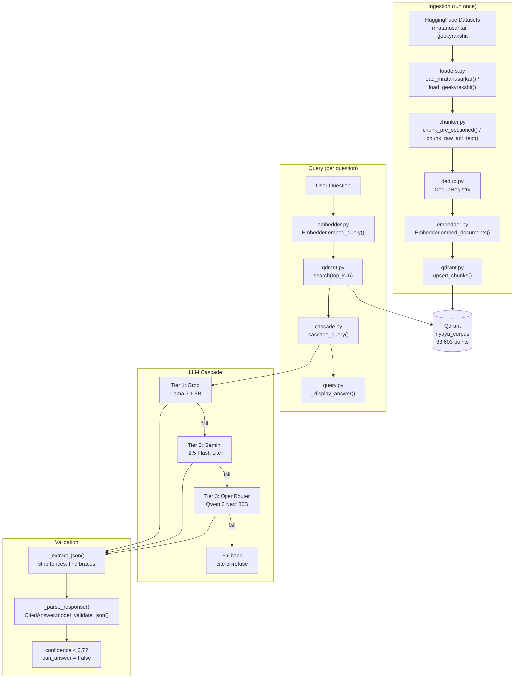

# Nyaya AI — Full Codebase Audit

*Generated 2026-07-09 from direct file reads of every `.py` file in the project.*

---

## 1. Per-File Summary

### Config & Schemas

#### [config.py](file:///c:/Users/mehta/Downloads/summer-internship/nyaya-ai/nyaya_ai/config.py) (74 lines)
**What it does:** Centralized configuration — all constants in one place. Qdrant storage settings, embedding model params, 3-tier LLM API keys (from env vars), cascade thresholds, retrieval params, HF dataset IDs, chunking limits.

| Key Config | Value |
|---|---|
| `QDRANT_PATH` / `QDRANT_URL` | `"./qdrant_data"` / `None` (local file mode) |
| `EMBEDDING_MODEL` / `EMBEDDING_DIM` | `BAAI/bge-m3` / 1024 |
| `GROQ_MODEL` | `llama-3.1-8b-instant` |
| `GEMINI_MODEL` | `gemini-2.5-flash-lite` |
| `OPENROUTER_MODEL` | `qwen/qwen3-next-80b-a3b-instruct:free` |
| `CONFIDENCE_THRESHOLD` | 0.7 |
| `TOP_K` | 5 |

**Imported by:** Every module in the codebase.
**State:** ✅ Working. Has `import os` for env var loading. Ollama config kept as commented reference.

---

#### [schemas.py](file:///c:/Users/mehta/Downloads/summer-internship/nyaya-ai/nyaya_ai/schemas.py) (130 lines)
**What it does:** Pydantic v2 models defining the data contracts for the entire system.

| Class | Responsibility |
|---|---|
| `Citation` | A single source reference — `source_type`, `act_name`, `section`, `quote` |
| `CitedAnswer` | LLM output contract — `answer`, `citations[]`, `confidence`, `can_answer`. Has `model_validator` enforcing citations when `can_answer=True`. |
| `CorpusChunk` | Ingestion model — `act_name`, `section_number`, `text`, `source`, `version`. Has `to_payload()` for Qdrant upsert and `dedup_key` property for cross-dataset dedup. |

**Imported by:** `chunker.py`, `dedup.py`, `loaders.py`, `qdrant.py`, `cascade.py`
**State:** ✅ Working. 22 tests pass.

---

### Ingestion Pipeline — `nyaya_ai/ingest/`

#### [chunker.py](file:///c:/Users/mehta/Downloads/summer-internship/nyaya-ai/nyaya_ai/ingest/chunker.py) (254 lines)
**What it does:** Section-level structural chunker for Indian legal Acts. Handles two input types: pre-sectioned data (just wraps into `CorpusChunk`) and raw Act text (regex-based section boundary detection).

| Function | Responsibility |
|---|---|
| `chunk_pre_sectioned()` | Wraps a single pre-split row into a `CorpusChunk`. Parses section number/title. |
| `chunk_raw_act_text()` | Regex splits raw Act text at section boundaries (`"27. Title.—"`). Tracks chapter headings. Handles long sections via `_split_long_section()`. |
| `_split_long_section()` | Splits overlong sections at sub-section markers `(1)`, `(2)` etc. |
| `_estimate_tokens()` | Rough `len(text) // 4` for token counting. |

**Key regex:** `SECTION_PATTERN` = `r"^(\d+[A-Z]?)\.\s+(.+?)[\u2014\-]"` with `re.MULTILINE`
**Imports from:** `config.py`, `schemas.py`
**Imported by:** `loaders.py`
**State:** ✅ Working. 10 tests pass.

---

#### [dedup.py](file:///c:/Users/mehta/Downloads/summer-internship/nyaya-ai/nyaya_ai/ingest/dedup.py) (55 lines)
**What it does:** Cross-dataset deduplication using normalized `(act_title, section_number)` keys.

| Method | Responsibility |
|---|---|
| `DedupRegistry.is_duplicate()` | Check if key already seen |
| `DedupRegistry.register()` | Add key to seen set |
| `DedupRegistry.register_and_check()` | Atomic check-then-register. Returns `True` if NEW. |
| `DedupRegistry.count` | Property returning unique pair count |

**Imports from:** `schemas.py` (uses `CorpusChunk.dedup_key`)
**Imported by:** `loaders.py`, `ingest.py`
**State:** ✅ Working. 10 tests pass.

---

#### [loaders.py](file:///c:/Users/mehta/Downloads/summer-internship/nyaya-ai/nyaya_ai/ingest/loaders.py) (244 lines)
**What it does:** Downloads Indian legal datasets from HuggingFace and converts to `CorpusChunk` lists. Three loader functions for three datasets.

| Function | Dataset | Status |
|---|---|---|
| `load_mratanusarkar()` | `mratanusarkar/Indian-Laws` (34,244 pre-sectioned rows) | ✅ Primary source, used in production |
| `load_geekyrakshit()` | `geekyrakshit/indian-legal-acts` (raw Act texts) | ✅ Secondary, dedup-filtered. Imported in `ingest.py` |
| `load_sahi19()` | `Sahi19/IndianLawComplete` (optional) | ⚠️ Implemented but not called — skipped in `ingest.py` |
| `_extract_act_name()` | Heuristic Act name extraction from first lines | ✅ Working |

**Imports from:** `config.py`, `chunker.py`, `dedup.py`, `schemas.py`
**Imported by:** `ingest.py`
**State:** ✅ Working. Uses lazy `from datasets import load_dataset` inside functions.

---

### Retrieval — `nyaya_ai/retrieval/`

#### [embedder.py](file:///c:/Users/mehta/Downloads/summer-internship/nyaya-ai/nyaya_ai/retrieval/embedder.py) (70 lines)
**What it does:** BGE-M3 embedding wrapper. Loads model once on init (~2.3 GB download on first run). Two public methods.

| Method | Responsibility |
|---|---|
| `Embedder.__init__()` | Lazy-imports `SentenceTransformer`, loads `BAAI/bge-m3` |
| `embed_documents()` | Batch encode for ingestion, `normalize_embeddings=True`, `batch_size=32` |
| `embed_query()` | Single text encode for search, `normalize_embeddings=True` |

**Imports from:** `config.py`
**Imported by:** `ingest.py`, `query.py`
**State:** ✅ Working. 8 tests pass (mocked).

---

### Storage — `nyaya_ai/store/`

#### [qdrant.py](file:///c:/Users/mehta/Downloads/summer-internship/nyaya-ai/nyaya_ai/store/qdrant.py) (177 lines)
**What it does:** Qdrant vector store management. Singleton client pattern. Supports both local file-based and Docker server modes.

| Function | Responsibility |
|---|---|
| `_get_client()` | Singleton `QdrantClient`. Uses `path=` when `QDRANT_URL is None`, `url=` otherwise. |
| `create_collection()` | Idempotent collection creation with dense vector config (1024-dim, cosine). |
| `upsert_chunks()` | Batch upsert with `CorpusChunk.to_payload()`. Internal batch size 100. |
| `search()` | Dense cosine search via `query_points()`. Returns `list[dict]` with `score`. |
| `get_point_count()` | Returns total indexed points for health checks. |

**Imports from:** `config.py`, `schemas.py`
**Imported by:** `ingest.py`, `query.py`
**State:** ✅ Working. 13 tests pass (mocked). Currently running in local file mode with 33,603 points indexed.

> [!NOTE]
> Qdrant issues a `UserWarning` at startup about local mode being suboptimal for >20,000 points. Functionally correct but search latency will improve when migrated to Docker/server mode.

---

### LLM Cascade — `nyaya_ai/llm/`

#### [prompts.py](file:///c:/Users/mehta/Downloads/summer-internship/nyaya-ai/nyaya_ai/llm/prompts.py) (87 lines)
**What it does:** Builds the system prompt for Mode 2 legal intelligence chat. Includes the `CitedAnswer` JSON schema inline, 7 rules (cite-only, no fabrication, verbatim quotes, confidence assessment, JSON-only output), edge case instructions.

| Function | Responsibility |
|---|---|
| `build_system_prompt()` | Returns the full system prompt string with embedded schema |

**Imports from:** Nothing (standalone)
**Imported by:** `cascade.py`
**State:** ✅ Working. No tests needed (static string generation).

---

#### [cascade.py](file:///c:/Users/mehta/Downloads/summer-internship/nyaya-ai/nyaya_ai/llm/cascade.py) (421 lines)
**What it does:** 3-tier cloud LLM cascade. Groq → Gemini → OpenRouter. Each tier has its own `_call_*` function using the OpenAI SDK pointed at different providers.

| Function | Responsibility |
|---|---|
| `_format_context()` | Formats Qdrant results into numbered context block |
| `_build_user_message()` | Builds the user message with context + question |
| `_call_groq()` | Tier 1 — Groq API, `response_format=json_object`, `temperature=0.1` |
| `_call_gemini()` | Tier 2 — Gemini via OpenAI-compatible endpoint, same JSON mode |
| `_call_openrouter()` | Tier 3 — OpenRouter with `HTTP-Referer`/`X-Title` headers |
| `_extract_json()` | Strips markdown fences, finds `{...}` in noisy output |
| `_parse_response()` | `_extract_json()` → `CitedAnswer.model_validate_json()` |
| `_make_fallback()` | Cite-or-refuse `CitedAnswer(can_answer=False, confidence=0.0)` |
| `_try_tier()` | Per-tier retry loop. Returns `CitedAnswer` or `None` to escalate. |
| `cascade_query()` | Orchestrator — tries T1→T2→T3, returns fallback if all fail. Never raises. |

**Imports from:** `config.py` (all API keys/models/thresholds), `prompts.py`, `schemas.py`
**Imported by:** `query.py`
**State:** ✅ Working. 20 tests pass. No TODOs or placeholder tiers remaining.

---

### CLI Entry Points (project root)

#### [ingest.py](file:///c:/Users/mehta/Downloads/summer-internship/nyaya-ai/ingest.py) (191 lines)
**What it does:** Full ingestion pipeline entry point. Connects Qdrant → loads both HF datasets with dedup → batch embeds with BGE-M3 (progress bar) → batch upserts (progress bar) → prints summary table.

**Imports from:** `config.py`, `dedup.py`, `loaders.py`, `embedder.py`, `qdrant.py`
**State:** ✅ Working. Successfully indexed 33,603 sections from ~1,021 Acts.

> [!NOTE]
> Docstring still references `geekyrakshit` in the Flow section (lines 14-15) and imports `load_geekyrakshit` — this matches the student's manual edits to re-add the secondary dataset.

---

#### [query.py](file:///c:/Users/mehta/Downloads/summer-internship/nyaya-ai/query.py) (236 lines)
**What it does:** Interactive Mode 2 REPL. Startup checks (Qdrant populated? Embedder loads?), welcome banner, `nyaya>` prompt loop. Per question: embed → search top-5 → `cascade_query()` → rich display.

| Function | Responsibility |
|---|---|
| `_print_banner()` | Welcome panel with corpus name and section count |
| `_display_answer()` | Green panel with answer + numbered citations + confidence score |
| `_display_refuse()` | Yellow panel + top 3 retrieved chunks shown |
| `main()` | Startup checks + REPL loop |

**Imports from:** `config.py`, `cascade.py`, `embedder.py`, `qdrant.py`
**State:** ✅ Working. Handles `quit`/`exit`/`q`/Ctrl+C/EOF/empty input gracefully.

> [!NOTE]
> Docstring (line 12) still references `"Ollama running with phi3:3.8b"` — stale, now uses 3-tier cloud cascade.

---

#### [datacheck.py](file:///c:/Users/mehta/Downloads/summer-internship/nyaya-ai/datacheck.py) (17 lines)
**What it does:** One-off exploration script. Loads `mratanusarkar/Indian-Laws`, counts unique Acts (1,021), checks key Act presence (ICA, IPC, IT Act, CPC, MSME).

**State:** ✅ Working utility script. Not part of the pipeline.

#### [tests/debug_regex.py](file:///c:/Users/mehta/Downloads/summer-internship/nyaya-ai/tests/debug_regex.py) (33 lines)
**What it does:** One-off regex debugging script for section pattern. Uses an older version of `SECTION_PATTERN` (with period in terminator). Kept for reference.

**State:** ⚠️ Stale (regex doesn't match current `chunker.py` pattern). Harmless.

---

### Test Files

| Test File | Tests | What's Covered |
|---|---|---|
| [test_schemas.py](file:///c:/Users/mehta/Downloads/summer-internship/nyaya-ai/tests/test_schemas.py) | 22 | Citation, CitedAnswer (validation, cite-or-refuse, confidence bounds), CorpusChunk (to_payload, dedup_key normalization) |
| [test_chunker.py](file:///c:/Users/mehta/Downloads/summer-internship/nyaya-ai/tests/test_chunker.py) | 10 | Pre-sectioned chunking, raw text section detection, chapter tracking, long section splitting, empty input |
| [test_dedup.py](file:///c:/Users/mehta/Downloads/summer-internship/nyaya-ai/tests/test_dedup.py) | 10 | Duplicate detection, normalization (trailing year, "The" prefix, case), register_and_check flow |
| [test_embedder.py](file:///c:/Users/mehta/Downloads/summer-internship/nyaya-ai/tests/test_embedder.py) | 8 | embed_documents count/shape, embed_query shape/normalize, batch consistency (all mocked) |
| [test_qdrant.py](file:///c:/Users/mehta/Downloads/summer-internship/nyaya-ai/tests/test_qdrant.py) | 13 | create_collection idempotency, upsert length validation, search result format, get_point_count (all mocked) |
| [test_cascade.py](file:///c:/Users/mehta/Downloads/summer-internship/nyaya-ai/tests/test_cascade.py) | 20 | format_context, extract_json (fences, nesting, errors), parse_response, tier1 success, low confidence, retry, T1→T2 escalation, T1→T2→T3 escalation, all-fail fallback, parse-failure escalation, never-raises |
| **Total** | **88** | **All passing** |

---

## 2. Functional Grouping Summary

### Group A: Ingestion Pipeline
**Files:** `ingest.py` → `loaders.py` → `chunker.py` + `dedup.py` → `embedder.py` → `qdrant.py`

**What it accomplishes:** Downloads Indian legal statutes from HuggingFace, splits raw Act text into section-level chunks (regex boundary detection), deduplicates across datasets using normalized `(act_name, section)` keys, embeds all chunks with BGE-M3 (1024-dim), and upserts into Qdrant's `nyaya_corpus` collection with full metadata payloads.

**Data flow:**
```
HuggingFace datasets
    ↓ load_mratanusarkar() / load_geekyrakshit()
CorpusChunk objects (act, section, text, source)
    ↓ DedupRegistry.register_and_check()
Deduplicated chunks
    ↓ Embedder.embed_documents()
1024-dim vectors
    ↓ upsert_chunks()
Qdrant nyaya_corpus (33,603 points)
```

**Current stats:** 33,603 sections from ~1,021 Indian Acts indexed.

---

### Group B: Query Flow
**Files:** `query.py` → `embedder.py` → `qdrant.py` → `cascade.py` → `prompts.py`

**What it accomplishes:** Takes a natural language legal question, embeds it, retrieves the top-5 most relevant statutory sections from Qdrant, passes them as context to a 3-tier LLM cascade (Groq → Gemini → OpenRouter), validates the JSON response against the `CitedAnswer` Pydantic schema, and renders a rich terminal display with the answer, citations (Act name + section + verbatim quote), and confidence score. If confidence is below 0.7 or the LLM says it can't answer, shows a yellow "Insufficient Information" panel instead.

**Data flow:**
```
User question
    ↓ Embedder.embed_query()
1024-dim query vector
    ↓ search(top_k=5)
Top 5 context chunks [{act_name, section, text, score}]
    ↓ cascade_query()
        ↓ _format_context() → numbered context block
        ↓ _call_groq() → raw JSON string
        ↓ _extract_json() → clean JSON
        ↓ _parse_response() → CitedAnswer
        ↓ confidence < 0.7? → can_answer=False
CitedAnswer (answer, citations, confidence, can_answer)
    ↓ _display_answer() / _display_refuse()
Rich terminal output
```

---

### Group C: Config & Schemas
**Files:** `config.py`, `schemas.py`

**What it accomplishes:** Defines all system constants (one source of truth) and the data contracts that bind everything together. `CitedAnswer` is the interface between the LLM cascade and the display layer. `CorpusChunk` is the interface between ingestion and storage. Both enforce validation at the boundary — no silent bad data.

---

### Group D: Infrastructure
**Files:** `pyproject.toml`, `requirements.txt`, `docker-compose.yml`, `.gitignore`

**What it accomplishes:** Python packaging (setuptools, `nyaya-ai` v0.1.0), dependency pinning, optional Docker setup for Qdrant (currently unused — local file mode), and git ignore rules for `qdrant_data/`, caches, and secrets.

---

## 3. Current Progress

### End-to-end functionality: **100% of Week 1 scope**

| Component | Status | Evidence |
|---|---|---|
| Dataset loading | ✅ | 33,603 sections from 1,021 Acts |
| Structural chunking | ✅ | Regex section detection, sub-section splitting, chapter tracking |
| Cross-dataset dedup | ✅ | Normalized key dedup across mratanusarkar + geekyrakshit |
| BGE-M3 embeddings | ✅ | 1024-dim, L2-normalized |
| Qdrant storage | ✅ | Local file mode, 33,603 points, cosine search |
| LLM cascade (3-tier) | ✅ | Groq → Gemini → OpenRouter, all wired |
| JSON extraction | ✅ | Markdown fence stripping, brace matching |
| Cite-or-refuse | ✅ | Confidence threshold + validation enforced |
| CLI REPL | ✅ | Rich display, graceful exit, fail-fast startup |
| Test coverage | ✅ | 88/88 passing |

### No TODOs or placeholder tiers remaining

Grepping the entire `nyaya_ai/` package for `TODO` returned **zero results**. The original Tier 2/3 placeholders in cascade.py have been fully replaced with working cloud API calls.

### Stale references (cosmetic only)
- [query.py L12](file:///c:/Users/mehta/Downloads/summer-internship/nyaya-ai/query.py#L12): Docstring says "Ollama running with phi3:3.8b" — should say "API keys set for cloud cascade"
- [tests/debug_regex.py L4-6](file:///c:/Users/mehta/Downloads/summer-internship/nyaya-ai/tests/debug_regex.py#L4-L6): Uses old `SECTION_PATTERN` with period in terminator — doesn't affect anything

---

## 4. Next Steps (Week 2+)

### Immediate (this week)

| # | What | File(s) | Why |
|---|---|---|---|
| 1 | **Add `.env` file support** | `config.py` | Currently API keys require `$env:GROQ_API_KEY=...` every session. Add `python-dotenv` and a `.env` file (gitignored). |
| 2 | **Fix stale docstrings** | `query.py` L10-13 | References Ollama/phi3 instead of cloud cascade. |
| 3 | **Add BM25 hybrid retrieval** | New: `nyaya_ai/retrieval/bm25.py`, modify `qdrant.py` | Dense-only search misses keyword-exact matches (e.g., "Section 420"). BM25 + dense fusion will improve retrieval. |
| 4 | **Add reranker** | New: `nyaya_ai/retrieval/reranker.py` | Re-score top-20 results down to top-5 using a cross-encoder before passing to LLM. |

### Week 2 Features

| # | What | File(s) | Why |
|---|---|---|---|
| 5 | **ICA §27 Enforcement Engine (F1)** | New: `nyaya_ai/features/ica27.py` | Detect non-compete clauses, flag as void, output negotiation stance. Hero feature. |
| 6 | **MSME Payment Violation Detector (F2)** | New: `nyaya_ai/features/msme.py` | Flag payment terms > 45 days, cite MSME Dev Act 2006 §16. |
| 7 | **FastAPI backend** | New: `nyaya_ai/api/` | Wrap `cascade_query()` as REST endpoint. Required for frontend. |
| 8 | **Eval framework** | New: `nyaya_ai/eval/` | RAGAS + custom citation precision metric. Report 4 eval targets. |

### Week 3-4

| # | What | File(s) | Why |
|---|---|---|---|
| 9 | **Semantic Clause Diff (F3)** | New: `nyaya_ai/features/diff.py` | Two contract versions → semantic diff. |
| 10 | **Agentic Batch Sweep (F5)** | New: `nyaya_ai/features/batch.py` | Scan folder of contracts for a NL query. |
| 11 | **Frontend (Next.js)** | New: `frontend/` | Web UI for the demo. |
| 12 | **Langfuse tracing** | Modify: `cascade.py` | Instrument LLM calls with trace IDs. |
| 13 | **Deploy** | Railway + Vercel | Ship it. |

---

## 5. Final Architecture (Target State)



### "Done" Looks Like

| Metric | Target | Current |
|---|---|---|
| End-to-end query latency | < 5s | ~2s (Tier 1 Groq) |
| Citation precision | > 90% | Not measured yet (needs eval framework) |
| Hallucination rate | < 5% | Not measured yet |
| Extraction F1 | > 0.88 | Not measured yet |
| Cost per contract | < ₹0.50 (p95) | ₹0 (free tiers) |
| Corpus size | ≥ 200 contracts | 33,603 sections / 1,021 Acts |
| Tests | All passing | 88/88 ✅ |

**The system is fully functional end-to-end for Mode 2 (Legal Intelligence Chat).** A user can type a question in the terminal and get a cited answer backed by Indian statutory law in ~2 seconds. The next milestone is evaluation metrics, the hero features (F1-F5), and the web frontend.
